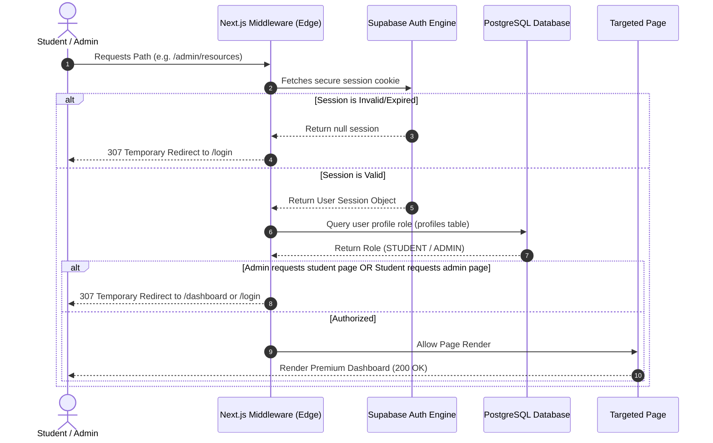
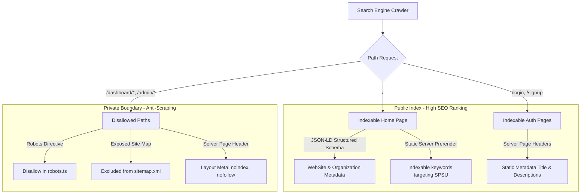

# 🎓 CampusCore — Premium Academic Resource Portal

CampusCore is a state-of-the-art, high-fidelity academic resources and study roadmaps portal specifically engineered for **Sir Padampat Singhania University (SPSU)**. It provides a secure, lightning-fast, and beautiful interface for students to access Previous Year Questions (PYQs), lecture notes, and curriculum syllabus, while offering a robust management suite for administrators.

---

## 🏗️ Architecture Diagrams & System Workflows

### 🛡️ 1. Secure Authentication & Role-Based Access Control (RBAC)
CampusCore utilizes a hybrid server-client model to authenticate users and route them securely. The system uses **Supabase Auth** tokens stored in secure HTTP-only cookies, verified by Next.js middleware at the edge before any page renders.



---

### 📂 2. Secure Private PDF Access (View vs. Download)
To prevent academic materials from being leaked, scraped, or hotlinked on external communication channels (like WhatsApp, Discord, or Telegram), the portal restricts direct access to Cloudinary CDN resources.

Instead, the frontend requests time-limited signed URLs that expire after **exactly 1 hour** through our secure gatekeeper API.

```mermaid
flowchart TD
    subgraph Client [Student Browser]
        ClickView[Student clicks 'View']
        ClickGet[Student clicks 'Get']
        Iframe[Inline PDF Viewer Iframe]
        DownloadTab[Temporary _blank Tab]
    end

    subgraph Server [Next.js API Gatekeeper]
        AuthCheck{Verify Session & Semester Access}
        SignGen[Generate Signed Cloudinary URL]
    end

    subgraph CDN [Cloudinary Media Server]
        AuthCDN{Validate API Signature & Expiry}
        StreamPDF[Serve PDF application/pdf]
        AttachmentPDF[Serve PDF content-disposition: attachment]
    end

    ClickView -->|1. GET /api/resources/:id/signed-url| AuthCheck
    ClickGet -->|1. GET /api/resources/:id/signed-url?download=true| AuthCheck

    AuthCheck -->|Failed Auth| Return401[Return 401 Unauthorized]
    AuthCheck -->|Success| SignGen

    SignGen -->|2a. Sign with type: upload & resource_type: raw| ReturnSignedView[Return JSON { url: signedUrl }]
    SignGen -->|2b. Sign with type: upload, resource_type: raw & attachment: true| RedirectSignedGet[307 Redirect to signedUrl]

    ReturnSignedView -->|3a. Load URL| Iframe
    Iframe -->|4a. GET Request| AuthCDN
    AuthCDN -->|Valid| StreamPDF
    StreamPDF -->|5a. Render Inline| Iframe

    RedirectSignedGet -->|3b. Load in background| DownloadTab
    DownloadTab -->|4b. GET Request| AuthCDN
    AuthCDN -->|Valid| AttachmentPDF
    AttachmentPDF -->|5b. Trigger Browser Save| DownloadTab
```

---

### 🌐 3. Search Engine Double-Barrier Privacy Suite
This architecture balances search engine optimization (SEO) for public entry points with total privacy for nested academic and administrative dashboards.



---

## 🛠️ Deep Dive: The "Why" and "How" of Key Systems

### 🗝️ 1. Credentials-Only Authentication
* **Why**: Providing Google OAuth introduces dependency on external Google Developer configurations and exposes the application to authentication redirections that disrupt the unified layout. By standardizing on credentials-only logins, we keep authentication fully localized.
* **How**:
  - We refactored `/login`, `/signup`, `/forgot-password`, and `/reset-password` routes into Next.js Server Components.
  - Doing this allows us to export **static SEO metadata** (needed by crawlers) from the server.
  - The heavy-lifting client logic is safely isolated inside dedicated client containers (`src/components/auth/login-form.tsx`, etc.), completely scrubbing the "Continue with Google" buttons and formatting separators for a unified, clean interface.

### 📐 2. Dynamic Subject Abbreviations (Schema Resiliency)
* **Why**: The database schema does not have a `code` column on the `subjects` table. Attempting to query `subjects (name, code)` inside PostgREST throws an instant SQL error (`42703`), causing resource query pages to crash or silently redirect students.
* **How**:
  - We updated both `src/app/(dashboard)/resources/page.tsx` and `/resources/[id]/view/page.tsx` database queries to select only the `name` column: `subjects (name)`.
  - We implemented a dynamic server-side abbreviation parser that converts raw subject titles into academic acronyms:
    ```typescript
    const derivedSubjectCode = resource.subjects?.name 
      ? resource.subjects.name.split(" ").map((w: string) => w[0]).join("").toUpperCase().slice(0, 4) 
      : "GEN";
    ```
  - This ensures complete schema resiliency and renders sleek badges (e.g., "C Programming" -> "CP", "Data Structures" -> "DS") with zero database overhead or compiler warnings.

### 🛡️ 3. Private Assets CDN Signature Pipeline
* **Why**: Storing PDFs in public Cloudinary buckets makes them vulnerable. Anyone who gets a link can share it widely, entirely bypassing your login screen. Storing them in private folders resolves this, but generating signatures with default options causes a `404 Resource not found` because the raw files are registered as `upload` types, not `private` or `image` types.
* **How**:
  - **The Fix (`src/lib/cloudinary.ts`)**: We aligned the signature generator by explicitly passing `type: "upload"` and `resource_type: "raw"` parameters to the Cloudinary Node.js SDK:
    ```typescript
    export function getSignedUrl(publicId: string, expiresAt: number, download: boolean = false) {
      return cloudinary.utils.private_download_url(publicId, "", {
        resource_type: "raw",
        type: "upload",
        expires_at: expiresAt,
        ...(download ? { attachment: true } : {}),
      });
    }
    ```
  - **Inline View Integration**: The `/api/resources/[id]/signed-url` endpoint responds with a signed URL without attachment parameters. Since the content type header returned by Cloudinary is `application/pdf`, the browser iframe loads it smoothly inline with a `200 OK`.
  - **Non-Blocking Background Downloads ("Get")**: Next.js client-side router (`<Link>`) intercepts standard API route clicks, changing the user's active page address bar to the Cloudinary URL and leaving them stuck on a blank tab. We replaced the `<Link>` wrapper with a standard HTML `<a>` tag pointing to `/api/resources/[id]/signed-url?download=true` configured with `target="_blank"` and `rel="noopener noreferrer"`. The download triggers instantly in a background thread, keeping the user’s primary dashboard page perfectly intact.

---

## 🛠️ Technology Stack

- **Framework**: [Next.js 16 (App Router)](https://nextjs.org/) utilizing the high-speed **Turbopack** compiler.
- **Styling**: [Tailwind CSS v4](https://tailwindcss.com/) dark-mode-first aesthetic.
- **Database & Auth**: [Supabase](https://supabase.com/) (PostgreSQL, custom schema tables, RLS security policies).
- **Media Engine**: [Cloudinary v2](https://cloudinary.com/) (Secure raw file uploads and signed CDN asset delivery).
- **Icons & Visuals**: [Lucide React](https://lucide.dev/), [Sonner](https://trigger.dev/) custom toast alerts.

---

## 💾 Database Schema Overview

CampusCore runs on a relational PostgreSQL database (managed via Supabase). The core relationships are structured as follows:

```
┌──────────────────┐         ┌──────────────────┐
│     profiles     │         │     subjects     │
├──────────────────┤         ├──────────────────┤
│ id (PK, Auth)    │         │ id (PK)          │
│ role (STUDENT/   │         │ name             │
│       ADMIN)     │◄────────│ branch_code      │
│ branch_code      │         │ semester         │
│ semester         │         └────────┬─────────┘
└────────┬─────────┘                  │
         │                            │ 1
         │ 1                          │
         │                            │ N
         │ N                         ┌▼─────────────────┐
         │                          │    resources     │
         │                          ├──────────────────┤
         │                          │ id (PK)          │
         │                          │ title            │
         │                          │ description      │
         │                          │ cloudinary_id    │
         │                          │ cloudinary_url   │
         │                          │ file_size_bytes  │
         │                          │ status (DRAFT/   │
         │                          │         PUBLISHED)
         │                          │ subject_id (FK)  │
         └─────────────────────────►│ uploader_id (FK) │
                                    │ type_id (FK) ◄───┼──────┐
                                    └──────────────────┘      │ N
                                                              │
                                     ┌──────────────────┐     │ 1
                                     │  resource_types  │     │
                                     ├──────────────────┤     │
                                     │ id (PK)          │─────┘
                                     │ name (PYQ, Notes)│
                                     │ is_pyq (Boolean) │
                                     └──────────────────┘
```

---

## ⚙️ Getting Started

### 1. Prerequisites
Ensure you have [Node.js (v18+)](https://nodejs.org/) installed on your machine.

### 2. Clone and Setup Project
```bash
git clone https://github.com/Sparkyyy45/campus-core.git
cd campus-core
npm install
```

### 3. Configure Local Environment
Create a `.env.local` file in the project root and enter your Supabase and Cloudinary API credentials. 

> [!IMPORTANT]
> **Keep your local credentials secure.** Never commit your active `.env.local` file to Github. The `.gitignore` file is pre-configured to keep your local variables completely private.

```env
# Supabase Configuration
NEXT_PUBLIC_SUPABASE_URL=https://your-project.supabase.co
NEXT_PUBLIC_SUPABASE_ANON_KEY=your-anon-public-key
SUPABASE_SERVICE_ROLE_KEY=your-service-role-secret-key

# Cloudinary Credentials
CLOUDINARY_CLOUD_NAME=your-cloud-name
CLOUDINARY_API_KEY=your-api-key
CLOUDINARY_API_SECRET=your-api-secret
NEXT_PUBLIC_CLOUDINARY_CLOUD_NAME=your-cloud-name

# App Settings
NEXT_PUBLIC_APP_URL=http://localhost:3000
```

### 4. Database Setup
Initialize your Supabase database using the sql schema file provided in this repository:
- Run the SQL scripts in `supabase/schema.sql` directly inside the Supabase SQL editor to scaffold the tables, profiles, and relational constraints.

### 5. Start Development Server
```bash
npm run dev
```
Open [http://localhost:3000](http://localhost:3000) inside your browser.

---

## 🚀 Building & Deploying

### Production Build
Generate an optimized Next.js production build:
```bash
npm run build
```

### Deploying to Vercel
1. Push your changes to your GitHub repository.
2. Go to [Vercel](https://vercel.com/) and import your `campus-core` project.
3. Configure the environment variables matching your `.env.local` keys.
4. Deploy!

---

## 📄 License
This project is licensed under the MIT License - see the LICENSE file for details.
