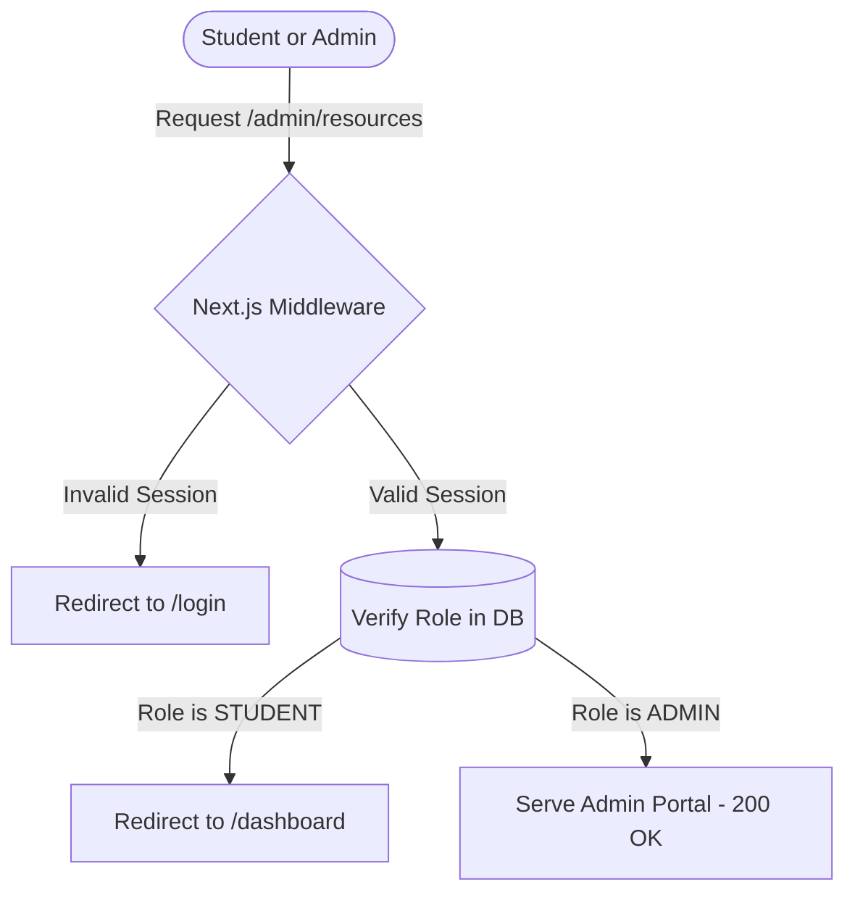
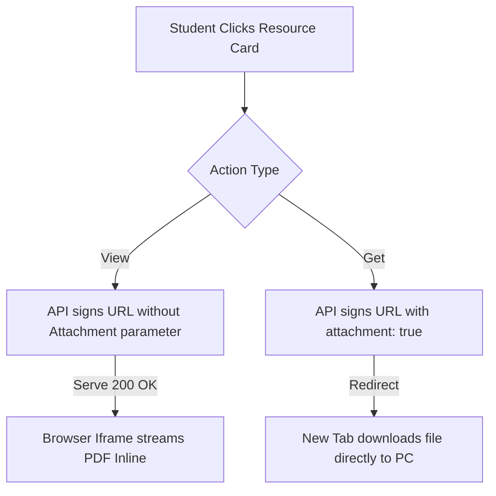

# 🎓 CampusCore — Premium Academic Resource Portal

<div align="center">

[](https://nextjs.org/)
[](https://tailwindcss.com/)
[](https://supabase.com/)
[](https://cloudinary.com/)
[](LICENSE)

*A premium, high-fidelity academic resources and study roadmaps portal specifically engineered for **Sir Padampat Singhania University (SPSU)**. Standardized for GSOC/Open-Source communities.*

[Key Features](#-key-features) • [Quick Start](#-quick-start) • [System Workflows](#-system-workflows) • [Architectural Decisions](#-architectural-decisions) • [Contributing](#-contributing)

</div>

---

## 📖 Introduction

**CampusCore** is an advanced open-source student portal that streamlines access to academic materials like Previous Year Questions (PYQs), lecture notes, and curriculum syllabus, while offering a robust management suite for administrators.

Unlike traditional file-sharing hubs, CampusCore is built around **privacy-first CDN delivery**, **zero-trust link-sharing security**, and a **fully responsive, dark-mode-first visual experience** that guarantees zero clutter and maximum speed.

---

## 🚀 Key Features

* **Student Resources Panel**: Search, filter, and discover files by academic branch (CS, IT, ME, EC, CE, EE) and semester (1-8).
* **Secure Inline PDF Viewer**: Custom sandboxed iframe that securely streams `application/pdf` streams directly inside the application, disabling raw links to prevent downloads.
* **Non-Blocking Background Downloads**: Triggered via native HTML `target="_blank"` anchor tags to fetch attachment headers in background threads, keeping the dashboard's active state undisturbed.
* **Role-Based Auth Console**: Fine-grained access control separating student dashboards from administrative database CRUD tables (users, announcements, roadmaps, and subjects).
* **Double-Barrier Privacy Indexing**: Double protection matching strict edge-level metadata (noindex/nofollow layouts) with a localized `robots.txt` configuration, ensuring auth dashboards are shielded from crawlers while maintaining high SEO rankings for landing portals.

---

## ⚙️ Quick Start

### 1. Installation
Clone the repository and install dependencies:
```bash
git clone https://github.com/Sparkyyy45/campus-core.git
cd campus-core
npm install
```

### 2. Configure Environment
Create a `.env.local` in the project root. The project's `.gitignore` is pre-configured to keep your variables private and secure:

```env
# Supabase Configuration
NEXT_PUBLIC_SUPABASE_URL=https://your-project.supabase.co
NEXT_PUBLIC_SUPABASE_ANON_KEY=your-anon-public-key
SUPABASE_SERVICE_ROLE_KEY=your-service-role-secret-key

# Cloudinary Configuration
CLOUDINARY_CLOUD_NAME=your-cloud-name
CLOUDINARY_API_KEY=your-api-key
CLOUDINARY_API_SECRET=your-api-secret
NEXT_PUBLIC_CLOUDINARY_CLOUD_NAME=your-cloud-name

# App Configuration
NEXT_PUBLIC_APP_URL=http://localhost:3000
```

### 3. Database Initialization
Copy the SQL scripts in `supabase/schema.sql` and run them inside your Supabase SQL Editor to configure all tables, relational links, and Row-Level Security (RLS) policies.

### 4. Run Development Server
```bash
npm run dev
```
Open [http://localhost:3000](http://localhost:3000) in your browser.

---

## 🏗️ System Workflows

### 🔐 1. Authentication & Role Routing (RBAC)
When a user requests a route, Next.js Middleware intercepts the request, validates the Supabase session, and handles role authorization before serving any content.



---

### 📂 2. Secure Private PDF Access (View vs. Download)
To prevent hotlinking, direct public URLs are strictly blocked (`401 Unauthorized`). The system generates time-limited signed URLs that expire after **exactly 1 hour** in two different modes.



---

## 💡 Architectural Decisions

### 🗝️ 1. Credentials-Only Authentication
* **Decision**: We completely removed external Google OAuth buttons and routes to provide an localized authentication wall.
* **Implementation**: Login, signup, and reset forms were migrated to client components inside static server layouts. This lets us export server-rendered SEO metadata while keeping form interactions highly responsive.

### 📐 2. Schema-Resilient Subject Codes
* **Decision**: The `subjects` table lacks a `code` column. Instead of performing complex database alterations, we dynamically derive codes on-the-fly.
* **Implementation**: We query only the `name` column and use a fast string parser to generate abbreviations (e.g. "Data Structures" -> "DS", "C Programming" -> "CP") directly inside Next.js Server Components. This keeps the database lightweight and ensures zero query faults.

### 🛡️ 3. Safe Background PDF Downloads
* **Decision**: Next.js client-side `<Link>` tags intercept file-download redirects, which forces the active browser tab to navigate to the Cloudinary URL.
* **Implementation**: We wrapped download buttons in standard HTML `<a>` tags with `target="_blank"` and `rel="noopener noreferrer"`. This triggers downloads in independent browser threads, leaving the active student dashboard open and completely undisturbed.

---

## 🤝 Contributing

We welcome open-source contributions from the global developer community and GSoC candidates!

1. Fork the Project.
2. Create your Feature Branch (`git checkout -b feature/AmazingFeature`).
3. Commit your Changes (`git commit -m 'feat: add amazing feature'`).
4. Push to the Branch (`git push origin feature/AmazingFeature`).
5. Open a Pull Request.

---

## 📄 License

This project is licensed under the MIT License - see the [LICENSE](LICENSE) file for details.

---

<div align="center">
Made with ❤️ by the open-source community for SPSU.
</div>
